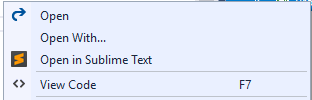

## Open in Sublime Text
A Visual Studio extension that adds a menu command that
lets you open any solution, project, folder or file in
Sublime Text.

[](https://ci.appveyor.com/project/madskristensen/openinsublimetext)

Download the extension at the
[VS Gallery](https://visualstudiogallery.msdn.microsoft.com/384892a5-7b67-42f2-b7de-574ef254a02a)
or get the
[nightly build](http://vsixgallery.com/extension/2925bbf7-d48b-4abd-83dc-1cd711d9b9ba/)

------------------------------------

This extension is for those times where you have a project
open in Visual Studio and you want to be able to quickly
open it in Sublime Text.

### Prerequisite
In order to use this extension, you must have Visual
Studio 2015 as well as Sublime Text installed.

You can
[download Sublime Text](http://www.sublimetext.com/)
for free.

### Solution Explorer
You can open any solution, project, folder or file in
Sublime Text by simply right-clicking it in Solution
Explorer and select
**Open in Sublime Text**.



### Change Sublime's settings
Sublime Text will by default remember which folders and
files was open last time it was closed. That makes opening
Sublime Text to a folder from the command line
problematic (this extension uses same mechanism).


To turn off this behavior in Sublime Text, go to
**Preferences -> User - Settings** and then add these two lines to the file:

```json
"hot_exit": false,
"remember_open_files": false
```